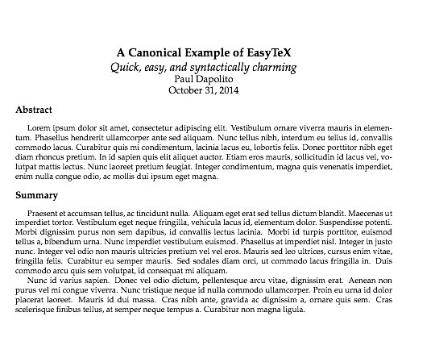
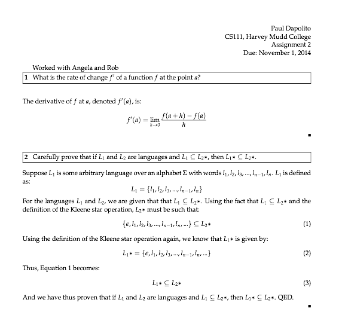

# Project Description

My project is called EasyTeX, and it is a domain-specific language for quickly creating clean, shareable, and nicely-formatted LaTeX documents. EasyTeX will offer support first for the typesetting of technical problem sets and memorandums, and will be expanded later-on to support the creation of any document.

## Motivation

EasyTex is motivated by a series of external factors as well as LaTeX-specific shortcomings. In more and more areas of Computer Science, we have seen the emergence of transcompiled languages that encompass more popular programming languages by bringing together syntactic sugar and enhanced formatting. These terse languages allow users to produce results more quickly and by writing less lines of code, both of which have innumerable benefits in the interests of time and collaboration. 

EasyTeX is motivated by two of such projects. The first is called [Jade](http://jade-lang.com/), which is a template engine for HTML. Jade allows programmers to create HTML pages whose code is clean, easily shareable, and extensible. For example, using the Jade API, the following code transformation is realized when creating a very simple web page:

Jade:

	doctype html
		html(lang="en")
  		head
  			title= Paul's Test Page
  	body
  		h1 Paul's Test Page
  		p.
  			How much less code can we write by using Jade?

Corresponding HTML:

	<!DOCTYPE html>
	<html lang="en">
		<head>
			<title>Paul's Test Page</title>
		</head>
		<body>
			<h1>Paul's Test Page</h1>
		</body>
	</html>

Our code for a simple HTML page is significantly less clunky in Jade, and seems much more human-readable. Similar results are yielded using the [CoffeeScript](http://coffeescript.org/) compiler to write a simple Fibonacci function:

CoffeeScript:

	this.fibonnaci = (n) -> 
	    if n == 1 or n == 2 then 1
	    else fibonnaci(n-1) + fibonnaci(n-2)

Corresponding JavaScript:

	this.fibonnaci(n) {
		if (n === 1 || n === 2) {
			return 1;
		} 
		else {
			return fibonnaci(n - 1) + fibonnaci(n - 2);
		}
	}; 

The conciseness and beauty of CoffeeScript are easily realized in the above example. By using tools like Jade or CoffeeScript, we are able to develop in powerful languages and do so in a way that is easy to write and easy to share. Such is the motivation for EasyTeX. I have often been discouraged from using LaTeX to typeset my work due to the excessive boilerplate markup required to create a document in LaTeX and the difficulty associated with maintaining LaTeX documents due to the non-enforcement of styling guidelines in the language. LaTeX documents grow quite quickly, and the language's verbose syntax can make collaboration particularly difficult.

To address these problems, EasyTeX will serve as a domain-specific language to allow for the creation of technical documents, like memondums and problem sets, more easily and more quickly. When we look at transcompiled languages like Jade and CoffeeScript, we see no loss in functionality when compared with the target language, and we see major gains in the way of productivity, readability, and cleanliness. These are the characteristics that will make EasyTeX useful, as the domain-specific language will encompass lots of LaTeX functionality in a way which is easier for writers to produce than using LaTeX itself.

It is appropriate for me to create EasyTeX as a domain-specific language because it will be geared more towards technical writings than other areas in which LaTeX is used. In truth, LaTeX can be used to beautifully typeset just about any sort of publication, but EasyTeX will allow for more streamlined typesetting in technical documents, such as a write-up for a design prototype or a calculus problem set. I feel that adhering closely to this domain will allow me to develop EasyTeX more naturally and from a self-serving perspective. As was true in my own experience and what is further confirmed by observation, many students at Harvey Mudd College do not begin typesetting their work until it becomes required in some course (like CS81). While this may be due, in some cases, to personal preference, I feel that more students would typeset their work if the LaTeX learning curve wasn't so steep, and if the language was easier to access and create documents with. EasyTeX will try to remove this barrier of entry from typesetting technical work. 

## Language Domain

The domain of EasyTeX is technical typesetting in academic settings. I hope to enable students, professors, scientists, and anyone else who wishes to typeset technical documents and problem sets to do so in the easiest way possible. This domain is useful because of its wide use and application in everyday life: it is an amazing communication medium for technical material. Anyone who wishes to typeset something, and allow it to be read by others in a way which is pleasing and presentable, will probably consider using LaTeX. EasyTeX will allow a domain-specific subset of this communication to occur more easily and more efficiently.

I envision EasyTeX as being an end-to-end solution to creating beautiful documents via LaTeX for anyone who wishes to typeset their technical work. There are a few DSLs already in existence for creating technical LaTeX documents, although none seem to have high adoption rates nor do most cater to creating a technical document from start to finish. 

## Language Design

EasyTeX will be designed to be efficient, clean, and easy-to-use. Much like documents written using LaTeX, EasyTeX documents will be text files written in any user's favorite text editor. EasyTeX programs, then, are simply text files that follow EasyTeX's grammar and formatting specifications. When the user desires, EasyTeX will provide an interface by which a text file is transcompiled to LaTeX and then compiled to produce a PDF. This text-to-PDF sequence constitutes the execution of an EasyTeX program, such that an inputted .txt file outputs a .pdf file under the EasyTeX interpreter.  

EasyTeX files will be parsed and internally represented as a hierarchy of Python objects. I intend to create classes which all share at least one common base class in order to structurally model a LaTeX document that might be written to produce a nicely typeset document. EasyTeX parsing will internally instantiate all different types of these objects in a hierarchical structure, and then EasyTeX interpretation will loop over respective data members in order to output well-formated LaTeX code. One might imagine how a user could accidentally ascribe incompatible data members to particular elements of the document they wish to produce. Because parsing EasyTeX will create a hierarchical tree of objects internally, user input will be checked every time a new object is constructed in the hierarchy. This ensures that EasyTeX will be able to produce errors that tell the user exactly where their input was problematic, perhaps by showing the faulty input and what the object being instantiated expects upon initialization. Such real-time and specific error-checking will allow EasyTeX users to easily identify and attempt to rectify syntax, run-time, and compile-time errors while creating documents.

While error-checking at every level of EasyTeX's internal representation will clearly elucidate errors to users, I insist on designing EasyTeX in order to prevent errors whenever possible. Because EasyTeX serves as a mapping from a cleanly formatted textual syntax to LaTeX, EasyTeX must be thoroughly tested in its ability to output valid LaTeX code. I will design EasyTeX will the intention that, if a user is formatting their EasyTeX document incorrectly, initialization of the various components of EasyTeX's internal representation will derive and clearly explain an error in lieu of outputting invalid lines of LaTeX. This level of detail will require thorough testing of EasyTeX's internal representation and LaTeX output, which, when coupled with a responsive and interactive interpretation process, will allow for an error-preventative and communicative EasyTeX environment.

## Example Computations

First is a short example of how a user might enter some simple lines of EasyTeX with the hopes of creating a document containing paragraphs of text.

EasyTeX:

	memorandum:
		author: Paul Dapolito
		date: October 31, 2014
		title: A Canonical Example of EasyTeX
		subtitle: Quick, easy, and syntactically charming!

		section:
			title: Abstract
			text:
				Lorem ipsum dolor sit amet, consectetur adipiscing elit. Vestibulum ornare viverra mauris in elementum. Phasellus hendrerit ullamcorper ante sed aliquam. Nunc tellus nibh, interdum eu tellus id, convallis commodo lacus. Curabitur quis mi condimentum, lacinia lacus eu, lobortis felis. Donec porttitor nibh eget diam rhoncus pretium. In id sapien quis elit aliquet auctor. Etiam eros mauris, sollicitudin id lacus vel, volutpat mattis lectus. Nunc laoreet pretium feugiat. Integer condimentum, magna quis venenatis imperdiet, enim nulla congue odio, ac mollis dui ipsum eget magna.

		section:
			title: Summary 
			text:
				Praesent et accumsan tellus, ac tincidunt nulla. Aliquam eget erat sed tellus dictum blandit. Maecenas ut imperdiet tortor. Vestibulum eget neque fringilla, vehicula lacus id, elementum dolor. Suspendisse potenti. Morbi dignissim purus non sem dapibus, id convallis lectus lacinia. Morbi id turpis porttitor, euismod tellus a, bibendum urna. Nunc imperdiet vestibulum euismod. Phasellus at imperdiet nisl. Integer in justo nunc. Integer vel odio non mauris ultricies pretium vel vel eros. Mauris sed leo ultrices, cursus enim vitae, fringilla felis. Curabitur eu semper mauris. Sed sodales diam orci, ut commodo lacus fringilla in. Duis commodo arcu quis sem volutpat, id consequat mi aliquam.

				Nunc id varius sapien. Donec vel odio dictum, pellentesque arcu vitae, dignissim erat. Aenean non purus vel mi congue viverra. Nunc tristique neque id nulla commodo ullamcorper. Proin eu urna id dolor placerat laoreet. Mauris id dui massa. Cras nibh ante, gravida ac dignissim a, ornare quis sem. Cras scelerisque finibus tellus, at semper neque tempus a. Curabitur non magna ligula.

Corresponding LaTeX:

	\documentclass[letterpaper, boxed]{hmcpset}
	\usepackage[margin=1in]{geometry}

	\begin{document}
	\begin{center} 
	\Large{\textbf{A Canonical Example of EasyTeX}} \\ 
	\textit{Quick, easy, and syntactically charming} \\
	\large{Paul Dapolito} \\
	\large{October 31, 2014}
	\end{center}

	\large \begin{flushleft} \textbf{Abstract} \end{flushleft}
	\normalsize 

	Lorem ipsum dolor sit amet, consectetur adipiscing elit. Vestibulum ornare viverra mauris in elementum. Phasellus hendrerit ullamcorper ante sed aliquam. Nunc tellus nibh, interdum eu tellus id, convallis commodo lacus. Curabitur quis mi condimentum, lacinia lacus eu, lobortis felis. Donec porttitor nibh eget diam rhoncus pretium. In id sapien quis elit aliquet auctor. Etiam eros mauris, sollicitudin id lacus vel, volutpat mattis lectus. Nunc laoreet pretium feugiat. Integer condimentum, magna quis venenatis imperdiet, enim nulla congue odio, ac mollis dui ipsum eget magna.

	\large \begin{flushleft} \textbf{Summary} \end{flushleft}
	\normalsize 

	Praesent et accumsan tellus, ac tincidunt nulla. Aliquam eget erat sed tellus dictum blandit. Maecenas ut imperdiet tortor. Vestibulum eget neque fringilla, vehicula lacus id, elementum dolor. Suspendisse potenti. Morbi dignissim purus non sem dapibus, id convallis lectus lacinia. Morbi id turpis porttitor, euismod tellus a, bibendum urna. Nunc imperdiet vestibulum euismod. Phasellus at imperdiet nisl. Integer in justo nunc. Integer vel odio non mauris ultricies pretium vel vel eros. Mauris sed leo ultrices, cursus enim vitae, fringilla felis. Curabitur eu semper mauris. Sed sodales diam orci, ut commodo lacus fringilla in. Duis commodo arcu quis sem volutpat, id consequat mi aliquam.

	Nunc id varius sapien. Donec vel odio dictum, pellentesque arcu vitae, dignissim erat. Aenean non purus vel mi congue viverra. Nunc tristique neque id nulla commodo ullamcorper. Proin eu urna id dolor placerat laoreet. Mauris id dui massa. Cras nibh ante, gravida ac dignissim a, ornare quis sem. Cras scelerisque finibus tellus, at semper neque tempus a. Curabitur non magna ligula.

	\end{document}

PDF produced by EasyTeX:

	
Next is a canonical example of how EasyTeX might be used to typeset a problem set.

EasyTeX:

	problem_set:
		author: Paul Dapolito
		collaborators: Angela, Rob
		duedate: November 1, 2014
		title: Assignment 3
		class: CS111
		school: Harvey Mudd College

		problem:
			label: 1
			statement: What is the rate of change $f'$ of a function $f$ at the point $a$?
			solution: 
				The derivative of $f$ at $a$, denoted $f'(a)$, is:
					$$ f'(a) = \lim_{k \to 0} \frac{f(a + h) - f(a)}{h} $$

		problem:
			label: 2
			statement: 
				Carefully prove that if $L_1$ and $L_2$ are languages and $L_1 \subseteq L_2*$, then $L_1 * \subseteq L_2*$
			solution:
				Suppose $L_1$ is some arbitrary language over an alphabet $\Sigma$ with words $l_1,l_2,l_3,...,l_{n-1},l_{n}$. $L_1$ is defined as:
					$$ L_1 = \{l_1, l_2, l_3,...,l_{n-1}, l_{n}\} $$

				For the languages $L_1$ and $L_2$, we are given that that $L_1 \subseteq L_2*$. Using the fact that $L_1 \subseteq L_2*$ and the definition of the Kleene star operation, $L_2*$ must be such that:
					$$ \{\epsilon, l_1, l_2, l_3,...,l_{n-1}, l_{n},...\} \subseteq L_2* #

				Using the definition of the Kleene star operation again, we know that $L_1*$ is given by:
					$$ L_1* =  \{\epsilon, l_1, l_2, l_3,...,l_{n-1}, l_{n},...\} $$ 

				Thus, Equation 1 becomes:
					$$ L_1* \subseteq L_2* $$

				And we have thus proven that if $L_1$ and $L_2$ are languages and $L_1 \subseteq L_2*$, then $L_1 * \subseteq L_2*$. QED.

Corresponding LaTeX:

	\documentclass[11pt,letterpaper,boxed]{hmcpset}
	\usepackage[margin=0.9in]{geometry}

	\name{Paul Dapolito}
	\class{CS111, Harvey Mudd College}
	\assignment{Assignment 2}
	\duedate{Due: November 1, 2014}

	\begin{document}

	Worked with Angela and Rob \\
	\begin{problem}[1]
	What is the rate of change $f'$ of a function $f$ at the point $a$?
	\end{problem}

	\begin{solution}
	The derivative of $f$ at $a$, denoted $f'(a)$, is:
	$$f'(a) = \lim_{k \to 0} \frac{f(a + h) - f(a)}{h}$$
	\end{solution}

	\begin{problem}[2]
	Carefully prove that if $L_1$ and $L_2$ are languages and $L_1 \subseteq L_2*$, then $L_1 * \subseteq L_2*$.
	\end{problem}

	\begin{solution}
	Suppose $L_1$ is some arbitrary language over an alphabet $\Sigma$ with words $l_1,l_2,l_3,...,l_{n-1},l_{n}$. $L_1$ is defined as:
		$$L_1 = \{l_1, l_2, l_3,...,l_{n-1}, l_{n}\}$$

	For the languages $L_1$ and $L_2$, we are given that that $L_1 \subseteq L_2*$. Using the fact that $L_1 \subseteq L_2*$ and the definition of the Kleene star operation, $L_2*$ must be such that:
		$$ \{\epsilon, l_1, l_2, l_3,...,l_{n-1}, l_{n},...\} \subseteq L_2* $$

	Using the definition of the Kleene star operation again, we know that $L_1*$ is given by:
		$$ L_1* =  \{\epsilon, l_1, l_2, l_3,...,l_{n-1}, l_{n},...\} $$

	Thus, Equation 1 becomes:
		$$ L_1* \subseteq L_2* $$

	And we have thus proven that if $L_1$ and $L_2$ are languages and $L_1 \subseteq L_2*$, then $L_1 * \subseteq L_2*$. QED
	\end{solution}

	\end{document}

PDF produced by EasyTeX:

In both cases, the user creates an EasyTeX document and is able to immediately produce a PDF with their work without ever encountering the underlying LaTeX!

