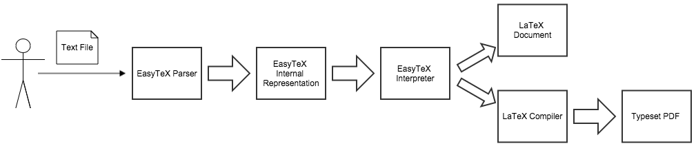
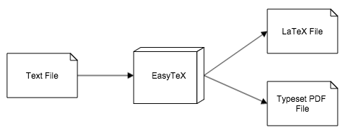

# Language Design and Implementation Overview

## Language Design

EasyTeX is designed to allow users to express their technical work using their favorite text editor. As I have been developing EasyTeX, I have created sample programs in my favorite editor, which is [Sublime Text 2](http://www.sublimetext.com/2). However, users of EasyTeX are not restricted to any one editor or environment, as EasyTeX's transcompiler will handle any file from any editor, so long as the file consists of text content which matches EasyTeX's grammar and specifications. If a user creates an EasyTeX document and saves it with a `.txt`extension (no particular extension is required to use EasyTeX, however), they can invoke the EasyTeX build process by passing the command-line tool the EasyTeX file they created.

When the EasyTeX tool executes, it takes an input file and attempts to parse it using EasyTeX's [parser](https://github.com/PaulDapolito/EasyTeX/blob/master/source/parser/parser.py). This parser scans the text file for various EasyTeX components (such as problems, collaborators, sections, among others) and creates an internal representation of Python objects that holds the inputted text that corresponds to each EasyTeX component. Each of these objects has a method to output its data members to LaTeX, and EasyTeX follows an iterative approach to output syntactically correct LaTeX code for each internally represented component of a user's document. This LaTeX code is then saved on a user's machine and passed to a LaTeX compiler to produce a typeset `.pdf` document. 

      
    EasyTeX Computational Model

From EasyTeX's computational model above, we can see that EasyTeX's parser takes a user's input file and creates an internal representation of Python objects, all of which implement the abstract [EasyTeXElement](https://github.com/PaulDapolito/EasyTeX/blob/master/source/ir/easytex_element.py). This internal representation takes the form of a hierarchy of objects. At the highest level is an EasyTeX [Document](https://github.com/PaulDapolito/EasyTeX/blob/master/source/ir/document.py), which has data fields `problem_set` and `memorandum`. These data members are meant to be populated with objects of EasyTeX's [ProblemSet](https://github.com/PaulDapolito/EasyTeX/blob/master/source/ir/problem_sets/problem_set.py) and [Memorandum](https://github.com/PaulDapolito/EasyTeX/blob/master/source/ir/memorandums/memorandum.py) classes, respectively. As one can see in the source code for an EasyTeX Document, a user may specify a document that is either a problem set or a memorandum, but not both.

An EasyTeX [ProblemSet](https://github.com/PaulDapolito/EasyTeX/blob/master/source/ir/problem_sets/problem_set.py) consists of an [Author](https://github.com/PaulDapolito/EasyTeX/blob/master/source/ir/shared/author.py), any number of [Collaborators](https://github.com/PaulDapolito/EasyTeX/blob/master/source/ir/shared/collaborator.py), an optional [DueDate](https://github.com/PaulDapolito/EasyTeX/blob/master/source/ir/problem_sets/due_date.py), an optional [Title](https://github.com/PaulDapolito/EasyTeX/blob/master/source/ir/shared/title.py), an optional [Course](https://github.com/PaulDapolito/EasyTeX/blob/master/source/ir/problem_sets/course.py), an optional [School](https://github.com/PaulDapolito/EasyTeX/blob/master/source/ir/problem_sets/school.py), and any number of [Problems](https://github.com/PaulDapolito/EasyTeX/blob/master/source/ir/problem_sets/problem.py). EasyTeX problems consist of an optional [Label](https://github.com/PaulDapolito/EasyTeX/blob/master/source/ir/problem_sets/label.py), a [Statement](https://github.com/PaulDapolito/EasyTeX/blob/master/source/ir/problem_sets/statement.py), and a [Solution](https://github.com/PaulDapolito/EasyTeX/blob/master/source/ir/problem_sets/solution.py).

      
    EasyTeX ProblemSet (* denotes optional field)

An EasyTeX [Memorandum](https://github.com/PaulDapolito/EasyTeX/blob/master/source/ir/memorandums/memorandum.py) consists of an [Author](https://github.com/PaulDapolito/EasyTeX/blob/master/source/ir/shared/author.py), any number of [Collaborators](https://github.com/PaulDapolito/EasyTeX/blob/master/source/ir/shared/collaborator.py), an optional [Date](https://github.com/PaulDapolito/EasyTeX/blob/master/source/ir/memorandums/date.py), a [Title](https://github.com/PaulDapolito/EasyTeX/blob/master/source/ir/shared/title.py), an optional [Subtitle](https://github.com/PaulDapolito/EasyTeX/blob/master/source/ir/memorandums/subtitle.py), and any number of [Sections](https://github.com/PaulDapolito/EasyTeX/blob/master/source/ir/memorandums/section.py). EasyTeX sections consist of a [Title](https://github.com/PaulDapolito/EasyTeX/blob/master/source/ir/shared/title.py) and [Content](https://github.com/PaulDapolito/EasyTeX/blob/master/source/ir/memorandums/content.py).

      
    EasyTeX Memorandum (* denotes optional field)

EasyTeX users can specify a `ProblemSet` or a `Memorandum` by creating a text file that matches the EasyTeX specification. When the EasyTeX tool executes, their inputted text is parsed into a corresponding internal representation using the hierarchy of objects described above. The user can manipulate and re-configure these data by repeatedly invoking EasyTeX on their input file. The control flow of this process is controlled by EasyTeX's parser and internal representation. EasyTeX's parser traverses through each line of the user's text file and attempts to create an internal representation using the aforementioned Python classes. If the user's text file is syntactically valid and can be parsed, then the EasyTeX parser yields an internally represented EasyTeX document which is either a `ProblemSet` or a `Memorandum`. Control flow is then handed to this internally represented document which iteratively calls the `latex_output` function of each `EasyTeXElement`. This method produces properly formatted LaTeX code for each component of EasyTeX's internal representation, which is saved on the user's file system in a `.tex` file. The top-level EasyTeX `Document` then invokes a LaTeX compiler on this `.tex` file to produce a `.pdf` for the user. This control flow, from start to finish, is invoked by the user on the command-line with an input file, and I plan to incorporate several different command-line options to allow EasyTeX users to manipulate this control flow to fit their specific needs.

      
    EasyTeX Control Flow

An program in the EasyTeX DSL requires an input text file. This file does not necessarily need to have a `.txt` extension, but its contents must consist of text that matches the EasyTeX specification. If this inputted text file can be parsed into a valid internal representation, the EasyTeX tool yields a `.tex` file consisting of syntactically correct LaTeX code that corresponds to the user's EasyTeX document as well as a `.pdf` consisting of the user's typeset work.

      
    EasyTeX Input and Output

There are several cases in which an EasyTeX program could go wrong. Problems with the EasyTeX tool would be encountered when a user inputs a text file that does not meet EasyTeX's specification for valid documents. This might mean that the user omitted a required field or left a field blank, or that the user did not incorporate proper whitespace delineation as specified by EasyTeX's grammar. Fortunately for the user, however, is that EasyTeX has robust error-checking and outputting functionality. Each class of EasyTeX's internal representation has its own associated error class, meaning that invalid input which is parsed and represented internally will produce an error message that tells the user what part of their input was invalid and why it could not be mapped to EasyTeX's internal representation. EasyTeX's parser also helps users identify and rectify errors in an efficient manner. If, at any point, the EasyTeX parser encounters text that it does not expect, the parser outputs the line and column number of the invalid input and what it expected to encounter at that position in the user's document. These error-checking methods will provide a standard of exactness when users provide invalid input to EasyTeX, and I intend to wrap this functionality in a graphical user interface (development environment built on web technologies) to allow users to create EasyTeX documents and receive real-time error-checking on their input.

While there are not many domain-specific languages on the Internet that target LaTeX directly, LaTeX itself is a domain-specific language for typesetting documents. There are many compilers, environments, and tools available to create LaTeX documents. Many of these tools, such as [TeXworks](http://tug.org/texworks/) and [TeXShops](http://pages.uoregon.edu/koch/texshop/), provide a text-editor environment and allow users to apply a LaTeX compiler to their input. These environments then produce helpful error messages and highlight lines of input which are invalid in real-time, allowing users to quickly fix their input and reapply the build process for creating typeset documents. I will create a development environment for EasyTeX similar to these LaTeX environments, such that users can receive feedback on their input immediately and repeatedly apply the EasyTeX tool to their input. Unlike most LaTeX development environments, though, I wish to create EasyTeX's using web technologies to achieve platform independence. Currently, many LaTeX editors are platform-specific, and I will overcome this widespread limitation by enabling users to work with EasyTeX from the Google Chrome browser. 

I would certainly like to emulate the environment support that surrounds LaTeX. EasyTeX, however, will differ from LaTeX in its formatting standards of cleanliness and simplicity. LaTeX documents often contain a plethora of boilerplate code to specify different facets of a document's format and spacing. While I would eventually like to expand EasyTeX to allow users to choose the specific font, margin size, line spacing, and other associated formatting specifications for their documents, I will first have standard values for these components built-in to EasyTeX. This will reduce the clunkiness associated with typesetting documents and will allow users, such as Harvey Mudd students, to typeset their work without paying much attention to the tedious LaTeX setup needed to do so. LaTeX documents also require the explicit use of opening and closing tags because there are no whitespace standards in the language. To remove the verbosity associated with opening and closing tags, EasyTeX enforces a standard of tab delineation to specify the start and end of various components of a user's document. I feel that this makes EasyTeX documents both more readable and more shareable, as users can traverse and identify components EasyTeX documents more efficiently than they could do so with LaTeX documents.

EasyTeX is very different from LaTeX in terms of the DSL's range of expression. A user can typeset almost any document using LaTeX, whether it be a problem set, memorandum, novel, essay, newspaper, or journal entry. EasyTeX, however, will be specific to the domain of typesetting technical problem sets and memorandums. I would certainly like to expand EasyTeX later-on to encompass a wider range of expression, but I feel that focusing on problem sets and memorandums at first will allow me to produce a high-quality product that is very useful in specific cases.

## Language Implementation

Your choice of an internal vs. external implementation and how and why you made that choice.

Your choice of a host language and how and why you made that choice.

Any significant syntax design decisions you've made and the reasons for those decisions.

An overview of the architecture of your system.

