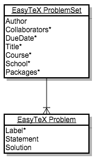
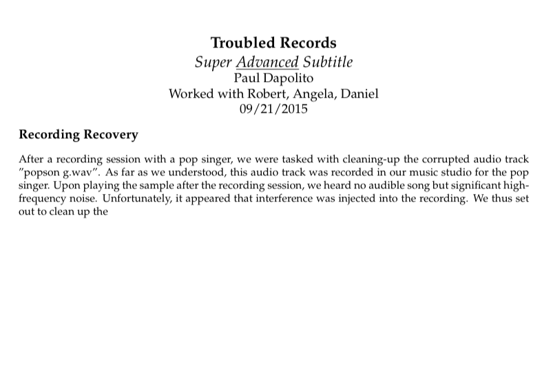
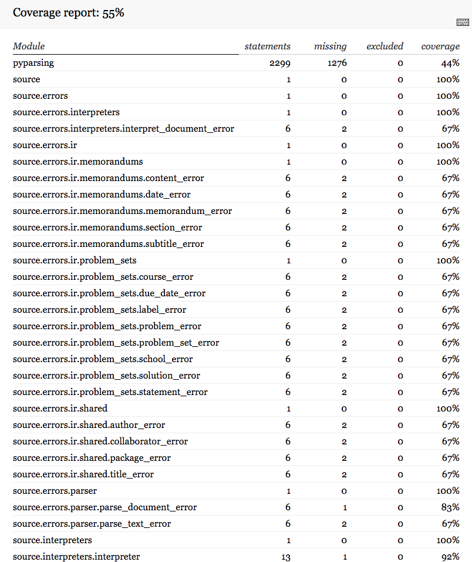
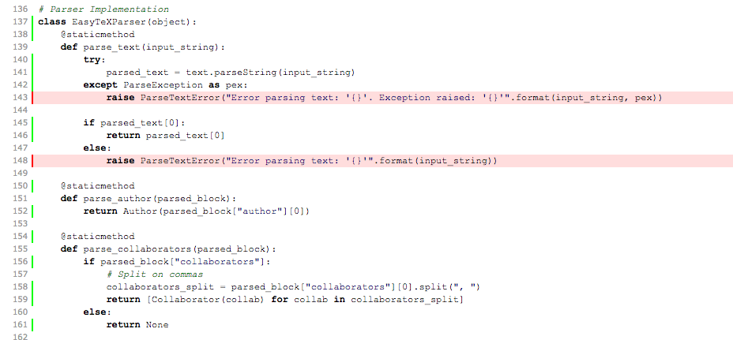

# EasyTeX Final Write-up - Paul Dapolito

## Introduction
EasyTeX is a domain-specific language for creating clean, shareable, and nicely-formatted technical documents using the popular typesetting language, LaTeX. Students, professors, scientists, and other members of the technical world often wish to typeset their documents in the interest of creating beautiful and readable products unbounded by the difficulties of handwriting. The language of choice for domain task is LaTeX, a general-purpose typesetting language used to create beautiful PDF documents. While LaTeX is quite useful for expressing technical work in a stunning medium, the language requires an excess of boilerplate markup to create a document, and maintaining LaTeX documents can be quite difficult due to the non-enforcement of styling guidelines in the language. This, combined with LaTeX's rather verbose syntax, make maintaining and collaborating on technical documents particularly difficult.

EasyTeX serves as a domain-specific language to allow for the creation of technical documents, like memorandums and problem sets, more easily and more quickly with a focus on readability. Collaboration is an important aspect of progress in the technical world, and to complement this paradigm, EasyTeX adheres to strict styling guidelines and formatting specifications to ensure that documents written in the language are shareable. Further than this, EasyTeX encapsulates boilerplate markup and "starter code" to enable users to produce beautiful documents in an efficient manner while still maintaining readability. In the domain of technical typesetting, there is a need for standardization and optimization in the best interests of collaboration and progress, and EasyTeX strives to deliver this typesetting experience in a way that is fast, easy-to-use, and shareable. 

## Language Design

EasyTeX is designed to allow users to express their technical work using their favorite text editor. In developing EasyTeX, I have created sample programs in my favorite text editor, [Sublime Text 2](http://www.sublimetext.com/2). This is simply my own preferred environment for typesetting documents, and EasyTeX users are not restricted to any one editor or environment, as the language's transcompiler will handle any file from any editor, so long as the file consists of text content which matches EasyTeX's [grammar](https://github.com/PaulDapolito/EasyTeX/blob/master/documents/grammar.md) and specifications:

If a user creates an EasyTeX document that meets these criteria and saves it with a `.txt` extension (although no particular file extension is required to use EasyTeX), they can invoke the EasyTeX build process by passing their file to EasyTeX's command-line interface. 

EasyTeX's syntax is designed to be concise and intuitive. The language does not incorporate the notion of opening and closing tags, and instead relies on tabbed-delineation to differentiate between different components of EasyTeX documents. This feature grants EasyTeX users a less verbose syntax than a more general purpose typesetting language, like LaTeX, and encourages readability in users' documents by way of requiring whitespace separation between components. The language's syntax is also meant align closely with a user's expectation as to what should be written. For example, if a user wishes to add certain LaTeX packages to their EasyTeX document in the interest of incorporating more advanced formatting or styling, they can do so by adding some number of comma-separated package names after a `packages:` specifier. This syntax design adheres closely to the English language and will allow users to add and modify components of their documents without having to repeatedly refer to the language's documentation.

When a user creates a text document that meets EasyTeX's specification, they can invoke EasyTeX's build process on the document by passing it to the language's command-line tool. When the EasyTeX tool executes, it takes an input file and attempts to parse it using EasyTeX's [parser](https://github.com/PaulDapolito/EasyTeX/blob/master/source/parser/parser.py). This parser scans the text file for various EasyTeX components (like problems, collaborators, sections, and others) and creates an internal representation of Python objects that holds the inputted text corresponding to reach EasyTeX component. Each object is treated differently by EasyTeX's [interpreter](https://github.com/PaulDapolito/EasyTeX/blob/master/source/interpreters/interpreter.py), and EasyTeX follows an iterative approach to output syntactically correct LaTeX code for each internally represented component of a user's document.

      
    EasyTeX Computational Model

&nbsp;
&nbsp;

From EasyTeX's computational model above, we can see that EasyTeX's parser takes a user's input file and creates and internal representation of Python objects. This internal representation takes the form of a hierarchy of objects. At the highest level are the two different types of EasyTeX documents: [`ProblemSet`](https://github.com/PaulDapolito/EasyTeX/blob/master/source/ir/problem_sets/problem_set.py) and [`Memorandum`](https://github.com/PaulDapolito/EasyTeX/blob/master/source/ir/memorandums/memorandum.py). These classes each contain data members for each component of an EasyTeX problem set and memorandum, respectively.

An EasyTeX `ProblemSet` consists of an [Author](https://github.com/PaulDapolito/EasyTeX/blob/master/source/ir/shared/author.py), any number of [Collaborators](https://github.com/PaulDapolito/EasyTeX/blob/master/source/ir/shared/collaborator.py), an optional [DueDate](https://github.com/PaulDapolito/EasyTeX/blob/master/source/ir/problem_sets/due_date.py), an optional [Title](https://github.com/PaulDapolito/EasyTeX/blob/master/source/ir/shared/title.py), an optional [Course](https://github.com/PaulDapolito/EasyTeX/blob/master/source/ir/problem_sets/course.py), an optional [School](https://github.com/PaulDapolito/EasyTeX/blob/master/source/ir/problem_sets/school.py), any number of [Packages](https://github.com/PaulDapolito/EasyTeX/blob/master/source/ir/shared/package.py), and one or more [Problems](https://github.com/PaulDapolito/EasyTeX/blob/master/source/ir/problem_sets/problem.py). EasyTeX Problems consist of an optional [Label](https://github.com/PaulDapolito/EasyTeX/blob/master/source/ir/problem_sets/label.py), a [Statement](https://github.com/PaulDapolito/EasyTeX/blob/master/source/ir/problem_sets/statement.py), and a [Solution](https://github.com/PaulDapolito/EasyTeX/blob/master/source/ir/problem_sets/solution.py).

      
    EasyTeX `ProblemSet` (* denotes optional field)

&nbsp;
&nbsp;

From this schema, an EasyTeX `ProblemSet` takes on the following textual form (with all fields left empty and all optional fields included):

	problem_set:
		author:
		collaborators:
		due_date:
		title:
		course:
		school:
		packages:
		
		problem:
			label:
			statement:
			
			solution:
			
		problem:
			label:
			statement:
				
			solution:

An EasyTeX [Memorandum](https://github.com/PaulDapolito/EasyTeX/blob/master/source/ir/memorandums/memorandum.py) consists of an [Author](https://github.com/PaulDapolito/EasyTeX/blob/master/source/ir/shared/author.py), any number of [Collaborators](https://github.com/PaulDapolito/EasyTeX/blob/master/source/ir/shared/collaborator.py), an optional [Date](https://github.com/PaulDapolito/EasyTeX/blob/master/source/ir/memorandums/date.py), a [Title](https://github.com/PaulDapolito/EasyTeX/blob/master/source/ir/shared/title.py), an optional [Subtitle](https://github.com/PaulDapolito/EasyTeX/blob/master/source/ir/memorandums/subtitle.py), any number of [Packages](https://github.com/PaulDapolito/EasyTeX/blob/master/source/ir/shared/package.py), and and one or more [Sections](https://github.com/PaulDapolito/EasyTeX/blob/master/source/ir/memorandums/section.py). EasyTeX sections consist of a [Title](https://github.com/PaulDapolito/EasyTeX/blob/master/source/ir/shared/title.py) and [Content](https://github.com/PaulDapolito/EasyTeX/blob/master/source/ir/memorandums/content.py).

      
    EasyTeX `Memorandum` (* denotes optional field)

&nbsp;
&nbsp;

From this schema, an EasyTeX Memorandum takes on the following textual form (with all fields left empty and all optional fields included):

	memorandum:
		author:
		collaborators:
		date:
		title:
		subtitle:
		packages: 
		
		section:
			title:
			content:
				
		section:
			title:
			content: 

EasyTeX users can create a `ProblemSet` or `Memorandum` by creating a text file that matches the EasyTeX specification. When the EasyTeX tool executes, their inputted text is parsed into a corresponding internal representation using the hierarchy of objects described above, which is then passed to EasyTeX's interpreter for evaluation. The user can manipulate and re-configure these data by repeatedly invoking EasyTeX's command-line tool on their input file. The control flow of this process is controlled by EasyTeX's parser, internal representation, and interpreter. EasyTeX's parser traverses through each line of the user's text file and attempts to create an internal representation using the aforementioned Python classes. If the user's text file is syntactically valid and can be parsed, then the EasyTeX parser yields an internally represented EasyTeX document which is either a `ProblemSet` or a `Memorandum`. This document is then handed to EasyTeX's interpreter, which produces properly formatted LaTeX code for each component of the internal representation corresponding to a user's EasyTeX document. EasyTeX's interpreter saves this LaTeX code on the user's file system in a `.tex` file, which is outputted in a readable manner to allow the user to refer to the underlying LaTeX of their typeset document. EasyTeX's command-line tool invokes a LaTeX compiler on the `.tex` file to produce `.pdf` file for the user.

	  
    EasyTeX Control Flow

&nbsp;
&nbsp;

This control flow, from start to finish, is invoked by the user on the command line with an input file:
	
	./easytex.sh input_file_name.txt
	
In order to use EasyTeX, a user must provide an input text file. This file does not need to have a `.txt` extension, but its contents must consist of text that matches the EasyTeX specification. If this inputted text file can be parsed into a valid internal representation, the EasyTeX tool yields a `.tex` file consisting of syntactically correct LaTeX code that corresponds to the user's EasyTeX document. Furthermore, the EasyTeX tool creates a `.pdf` output consisting of the user's typeset  work.

      
    EasyTeX Input and Output

&nbsp;
&nbsp;

There are several cases in which an EasyTeX program could go wrong. Problems with the EasyTeX tool would be encountered when a user inputs a text file that does not meet EasyTeX's specification for valid documents. This might mean that the user omitted a required field or left a field blank, or that the user did not incorporate proper tabbed-delineation as specified by EasyTeX's grammar. Fortunately for the user, however, is that EasyTeX has robust error-checking and outputting functionality. Each class of EasyTeX's internal representation has its own associated error class, meaning that invalid input which is parsed and represented internally produces an error message that tells the user what part of their input was invalid and why it brought about the failure to instantiate EasyTeX's internal representation. EasyTeX's parser also helps users identify and rectify errors in an efficient manner. If, at any point, the EasyTeX parser encounters text that it does not expect and cannot parse, the parser outputs the exact line and column number of the invalid input and what it expected to encounter at that position in the user's document. These error-checking methods provide a standard of exactness when users provide invalid input to EasyTeX. 

While there are not many domain-specific languages on the Internet that target LaTeX directly, LaTeX itself is a domain-specific language for typesetting documents. LaTeX is compiled by a variety of tools, such as `pdflatex`, to create PDF documents. LaTeX can also be compiled to create PostScript documents or DVI documents. There are many such compilers, environments, and tools available for creating LaTeX documents. Many of these tools, such as [TeXworks](http://tug.org/texworks/) and [TeXShop](http://pages.uoregon.edu/koch/texshop/), provide a text-editor (complete with syntax highlighting) environment and allow users to apply a LaTeX compiler to their input. Many LaTeX environments, with a wide array of features, are hosted on the web, such as [writeLaTeX](https://www.writelatex.com/) and [ShareLaTeX](https://www.sharelatex.com/). These environments, upon compilation, produce helpful error messages and highlight lines of input which are invalid in real-time, allowing users to quickly fix their input and reapply the build process for creating typeset documents. While I do strive to create an environment for EasyTeX similar to these interfaces built on web technologies, I have thus far only implemented [syntax highlighting](https://github.com/PaulDapolito/EasyTeX/blob/master/source/EasyTeX%20Grammar.tmLanguage) for the language.

Eventually, I would like to emulate the environment support that surrounds LaTeX. EasyTeX, however, will differ from LaTeX in its formatting standards of cleanliness and simplicity. LaTeX documents often contain a plethora of boilerplate code to specify different facets of a document's format and spacing. I would like to eventually expand EasyTeX to allow users to choose the specific font, margin size, line spacing, and other associated formatting specifications for the documents in a syntactically charming way. However, in the interest of reducing EasyTeX's clunkiness and allowing users, like students at Harvey Mudd, to typeset their work without paying much attention to the tedious setup needed to typeset with LaTeX, EasyTeX currently supports only the explicit specification of LaTeX packages to be included in a user's document with other formatting options, like font style and margin spacing, built-in to the language. 

As was previously mentioned, EasyTeX enforces a whitespace standard of tabbed-delineation to specify the start and end of various components of a user's document. Because LaTeX does not enforce any whitespace standards, the language requires the use of verbose opening and closing tags for all elements of a document. I feel that EasyTeX's enforcement of tabbed-delineation makes EasyTeX documents both more readable and more shareable than LaTeX documents, as EasyTeX users can traverse and identify components of EasyTeX documents more efficiently than they could do so with LaTeX documents. EasyTeX is also very different from LaTeX in terms of the DSL's range of expression. A user can typeset almost any type of document using LaTeX, whether it be a problem set, memorandum, novel, essay, textbook, newspaper, or journal entry. EasyTeX, however, is specific to the domain of typesetting technical problem sets and memorandums. I would certainly like to expand EasyTeX later-on to encompass a wider range of expression, but I feel that focusing on problem sets and memorandums at first has allowed me to produce a high-quality product that is very useful for typesetting these two types of documents. 

## Tutorials by Example

### Problem Sets
Suppose we wanted to typeset a problem set using EasyTeX (assuming all installation and setup for the language as per the project's [README](https://github.com/PaulDapolito/EasyTeX/blob/master/README.md) has been completed). We know, from the specification of a [problem set](https://github.com/PaulDapolito/EasyTeX/blob/master/documents/problem_set.md), the following structure must be maintained to typeset our work:

#### Headers
<table class="tg">
  <tr>
    <th class="tg-e3zv">Field Name</th>
    <th class="tg-e3zv">Required/Optional</th>
  </tr>
  <tr>
    <td class="tg-031e">author</td>
    <td class="tg-031e">Required</td>
  </tr>
  <tr>
    <td class="tg-031e">collaborators</td>
    <td class="tg-031e">Optional</td>
  </tr>
  <tr>
    <td class="tg-031e">due_date</td>
    <td class="tg-031e">Optional</td>
  </tr>
  <tr>
    <td class="tg-031e">title</td>
    <td class="tg-031e">Optional</td>
  </tr>
  <tr>
    <td class="tg-031e">course</td>
    <td class="tg-031e">Optional</td>
  </tr>
  <tr>
    <td class="tg-031e">school</td>
    <td class="tg-031e">Optional</td>
  </tr>
  <tr>
    <td class="tg-031e">packages</td>
    <td class="tg-031e">Optional</td>
  </tr>
</table>

#### Problems

<table class="tg">
  <tr>
    <th class="tg-e3zv">Field Name</th>
    <th class="tg-e3zv">Required/Optional</th>
  </tr>
  <tr>
    <td class="tg-031e">label</td>
    <td class="tg-031e">Optional</td>
  </tr>
  <tr>
    <td class="tg-031e">statement</td>
    <td class="tg-031e">Required</td>
  </tr>
  <tr>
    <td class="tg-031e">solution</td>
    <td class="tg-031e">Required</td>
  </tr>
</table>
&nbsp;
&nbsp;

#### Problem Set Example 1

From these specifications, let's create a problem set with one problem and all optional fields filled using our favorite text editor, Sublime Text 2 (the following EasyTeX file is identical to [samples/problem\_set\_sample\_1.txt](https://github.com/PaulDapolito/EasyTeX/blob/master/samples/problem_set_sample_1.txt)):

      
    <code>problem_set_1.txt</code>, EasyTeX File

&nbsp;
&nbsp;

Now, if we save this file on our Desktop as `problem_set_1.txt`, we can invoke EasyTeX's parser and interpreter on the file by entering EasyTeX's root directory and executing the following command on the command line:

	./easytex.sh ~/Desktop/problem_set_1.txt
	
The command-line interface will print the following two lines to indicate that EasyTeX's computation has completed without errors:

	Running EasyTeX!
	EasyTeX completed computation!

Now, if we look in our Desktop folder, we will see the following four new files:

   * `problem_set_1.pdf`: PDF file corresponding to the inputted EasyTeX file
   * `problem_set_1.tex`: LaTeX file corresponding to the inputted EasyTeX file. This is the `.tex` file that is used to produce the `.pdf` file.
   * `problem_set_1.log`: Log file from the creation of the `.pdf` file.
   * `problem_set_1.aux`: Auxiliary file from the creation of the `.pdf` file.

Two of these files are of much significance. First is the generated LaTeX file, `problem_set_1.tex`. This is the underlying file for the PDF that was produced, and the corresponding LaTeX is outputted as human-readable and nicely formatted code:

      
    <code>problem_set_1.tex</code>, EasyTeX-generated LaTeX File

&nbsp;
&nbsp;

Second is the generated PDF, `problem_set_1.pdf` representing the typeset version of our EasyTeX problem set:

      
    <code>problem_set_1.pdf</code>, EasyTeX-generated PDF

&nbsp;
&nbsp;

#### Problem Set Example 2

Suppose we wish to create a more lengthy and advanced problem set excluding most of the optional fields. Let's create a problem set with two problems and all optional fields excluded besides the `collaborators` field (the following EasyTeX file is identical to [samples/problem\_set\_sample\_2.txt](https://github.com/PaulDapolito/EasyTeX/blob/master/samples/problem_set_sample_2.txt)):

      
    <code>problem_set_2.txt</code>, EasyTeX File

&nbsp;
&nbsp;

Invoking EasyTeX using the [easytex.sh](https://github.com/PaulDapolito/EasyTeX/blob/master/easytex.sh) (executing `./easytex.sh ~/Desktop/problem_set_2.txt` from the project's root directory) script yields the following LaTeX and PDF files, respectively:

      
    <code>problem_set_2.tex</code>, EasyTeX-generated LaTeX File

&nbsp;
&nbsp;

      
    <code>problem_set_2.pdf</code>, EasyTeX-generated PDF Page 1

&nbsp;
&nbsp;

      
    <code>problem_set_2.pdf</code>, EasyTeX-generated PDF Page 2

&nbsp;
&nbsp;

### Memorandums
Suppose we wanted to typeset a memorandum using EasyTeX (assuming all installation and setup for the language as per the project's [README](https://github.com/PaulDapolito/EasyTeX/blob/master/README.md) has been completed). We know, from the specification of a [memorandum](https://github.com/PaulDapolito/EasyTeX/blob/master/documents/memorandum.md), the following structure must be maintained to typeset our work:

#### Headers
<table class="tg">
  <tr>
    <th class="tg-e3zv">Field Name</th>
    <th class="tg-e3zv">Required/Optional</th>
  </tr>
  <tr>
    <td class="tg-031e">author</td>
    <td class="tg-031e">Required</td>
  </tr>
  <tr>
    <td class="tg-031e">collaborators</td>
    <td class="tg-031e">Optional</td>
  </tr>
  <tr>
    <td class="tg-031e">date</td>
    <td class="tg-031e">Optional</td>
  </tr>
  <tr>
    <td class="tg-031e">title</td>
    <td class="tg-031e">Required</td>
  </tr>
  <tr>
    <td class="tg-031e">subtitle</td>
    <td class="tg-031e">Optional</td>
  </tr>
  <tr>
    <td class="tg-031e">packages</td>
    <td class="tg-031e">Optional</td>
  </tr>
</table>

#### Sections
<table class="tg">
  <tr>
    <th class="tg-e3zv">Field Name</th>
    <th class="tg-e3zv">Required/Optional</th>
  </tr>
  <tr>
    <td class="tg-031e">title</td>
    <td class="tg-031e">Required</td>
  </tr>
  <tr>
    <td class="tg-031e">content</td>
    <td class="tg-031e">Required</td>
  </tr>
</table>

#### Memorandum Example 1

From these specifications, let's create a memorandum with one section and all optional fields filled using our favorite text editor, Sublime Text 2 (the following EasyTeX file is identical to [samples/memorandum\_sample\_1.txt](https://github.com/PaulDapolito/EasyTeX/blob/master/samples/memorandum_sample_1.txt)):

      
    <code>memorandum_1.txt</code>, EasyTeX File

&nbsp;
&nbsp;

Now, if we save this file on our Desktop as `memorandum_1.txt`, we can invoke EasyTeX's parser and interpreter on the file by entering EasyTeX's root directory and executing the following command on the command line:

	./easytex.sh ~/Desktop/memorandum_1.txt
	
The command-line interface will print the following two lines to indicate that EasyTeX's computation has completed without errors:

	Running EasyTeX!
	EasyTeX completed computation!

Now, if we look in our Desktop folder, we will see the following four new files:

   * `memorandum_1.pdf`: PDF file corresponding to the inputted EasyTeX file
   * `memorandum_1.tex`: LaTeX file corresponding to the inputted EasyTeX file. This is the `.tex` file that is used to produce the `.pdf` file.
   * `memorandum_1.log`: Log file from the creation of the `.pdf` file.
   * `memorandum_1.aux`: Auxiliary file from the creation of the `.pdf` file.

Two of these files are of much significance. First is the generated LaTeX file, `memorandum_1.tex`. This is the underlying file for the PDF that was produced, and the corresponding LaTeX is outputted as human-readable and nicely formatted code:

      
    <code>memorandum_1.tex</code>, EasyTeX-generated LaTeX File

&nbsp;
&nbsp;

Second is the generated PDF, `memorandum_1.pdf` representing the typeset version of our EasyTeX memorandum:

      
    <code>memorandum_1.pdf</code>, EasyTeX-generated PDF

&nbsp;
&nbsp;

#### Memorandum Example 2

Suppose we wish to create a more lengthy and advanced memorandum excluding most of the optional fields. Let's create a memorandum with two sections and all optional fields excluded (the following EasyTeX file is identical to [samples/memorandum\_sample\_2.txt](https://github.com/PaulDapolito/EasyTeX/blob/master/samples/memorandum_sample_2.txt) with some content removed for brevity):

      
    <code>memorandum_2.txt</code>, EasyTeX File

&nbsp;
&nbsp;

Invoking EasyTeX using the [easytex.sh](https://github.com/PaulDapolito/EasyTeX/blob/master/easytex.sh) (executing `./easytex.sh ~/Desktop/memorandum_2.txt` from the project's root directory) script yields the following LaTeX and PDF files, respectively:

      
    <code>memorandum_2.tex</code>, EasyTeX-generated LaTeX File

&nbsp;
&nbsp;

      
    <code>memorandum_2.pdf</code>, EasyTeX-generated PDF

&nbsp;
&nbsp;

## Language Implementation

I chose to implement EasyTeX as an external domain-specific language due to my lack of familiarity with languages, other than LaTeX, available for typesetting documents. I have only ever used LaTeX to typeset my work, and my entire motivation in creating EasyTeX was to develop a tool that is less clunky and easier-to-use than LaTeX. EasyTeX has an entirely different syntax and whitespace specification from LaTeX, and I thus decided to implement EasyTeX externally, as I felt that doing so would allow me to truly overcome the shortcomings I identified in LaTeX.

In creating EasyTeX as an external DSL, I implemented the language entirely in Python. I made this choice because I felt that Python, being a high-level language, would enable me to develop quickly and efficiently and try out many different ideas for the project. I have much experience developing software in Python, but I had never implemented a parser in the language before developing EasyTeX's parser. This challenge seemed interesting to me, and I excitedly worked through a robust parser implementation for EasyTeX using Python's [pyparsing](http://pyparsing.wikispaces.com/) module. Although Python's semantics are entirely different than EasyTeX's semantics, Python served as an easy-to-use and robust interface by which users' documents could be parsed and interpreted into LaTeX. I had never utilized Python in this sort of intermediary role, and I feel that doing so has been a great learning experience. I also chose host EasyTeX in Python because of the inordinate number of tools and modules available for the language. I have loved developing EasyTeX in the [PyCharm IDE](https://www.jetbrains.com/pycharm/), as it provides great support for executing and reviewing [unit tests](https://docs.python.org/2/library/unittest.html) via the [nose](https://nose.readthedocs.org/en/latest/) module. I wanted to allow myself to focus entirely on designing EasyTeX to meet the goals I specified for the project while avoiding the imposition of any bounds on EasyTeX's expandability, and I felt that Python provided me with the most efficient development experience because of its syntactic simplicity and unbounded [support network](http://stackoverflow.com/questions/tagged/python). In developing EasyTeX, I reaped many of the benefits of choosing Python as its host language, especially while implementing EasyTeX's parser. No matter what problem I came across, I eventually identified a solution by referencing the extensive number of resources available for the language on the Internet.

EasyTeX's software architecture is laid out to be extensible, modular, and hierarchical, all of which were complemented by Python's general-purposeness. I will attempt to describe the language's software architecture along the timeline of the EasyTeX production process. The first major component in allowing an EasyTeX user to typeset their technical documents is the language's build and deploy process. EasyTeX users are able to clone or download the project's repository, which delivers them EasyTeX's source code, tests, documentation, and sample documents. In order to actually use the language, users must first execute the project's [`boostrap.sh`](https://github.com/PaulDapolito/EasyTeX/blob/master/bootstrap.sh) script. This script uses [pip](https://pypi.python.org/pypi/pip), the Python package management tool, to install all of the Python packages required ([pyparsing](http://pyparsing.wikispaces.com/), [coverage](https://pypi.python.org/pypi/coverage), and [nose](https://nose.readthedocs.org/en/latest/)) to use EasyTeX into a [virtual environment](http://docs.python-guide.org/en/latest/dev/virtualenvs/) located on the user's workstation at `/usr/local/EasyTeX/venv`. This bootstrap procedure must be executed only once on a user's machine, and the virtual environment created is invoked each time a user invokes EasyTeX using the project's [`easytex.sh`](https://github.com/PaulDapolito/EasyTeX/blob/master/easytex.sh) script.

      
    EasyTeX Build and Deploy Process

&nbsp;
&nbsp;

This build and deploy procedure is executed and tested every time a commit is added to the project using a [Travis CI repository](https://travis-ci.org/PaulDapolito/EasyTeX). This continuous integration tool clones the repository, performs the bootstrap procedures, and executes EasyTeX's [tests](https://github.com/PaulDapolito/EasyTeX/tree/master/source/tests) each time the project's GitHub repository changes.

When this deployment process is completed once, EasyTeX users are free to create and typeset documents. The first step in this procedure is creating a document in a text editor. While EasyTeX does not yet provide a development environment for users of the language, a [syntax highlighting grammar file](https://github.com/PaulDapolito/EasyTeX/blob/master/source/EasyTeX%20Grammar.tmLanguage) is provided for EasyTeX users to integrate into their text-editing environment. The user can pass their inputted text file to the language's [`easytex.sh`](https://github.com/PaulDapolito/EasyTeX/blob/master/easytex.sh) script on the command line. This script simply activates EasyTeX's virtual environment and passes the user's file to EasyTeX's driver program, [`easytex.py`](https://github.com/PaulDapolito/EasyTeX/blob/master/easytex.py), to begin the EasyTeX compilation and interpretation process. This driver program manages EasyTeX's end-to-end PDF generation procedure.

The first major component of EasyTeX's compilation and interpretation process is the language's [parser](https://github.com/PaulDapolito/EasyTeX/blob/master/source/parser/parser.py). This parser is implemented using Python's [pyparsing](http://pyparsing.wikispaces.com/) module, and as such, EasyTeX's grammar adapted to the specifications of `pyparsing` is included in the parser. The grammar uses a combination of regular expression as well as keyword values from the parsing module. EasyTeX uses this grammar to recursively parse a user's document in its `parse_document` function and instantiate a valid internal representation from a user's document. This functionality is thoroughly tested in the [parser's testing suite](https://github.com/PaulDapolito/EasyTeX/blob/master/source/tests/parser_tests.py), which was implemented using the [unittest](https://docs.python.org/2/library/unittest.html) and [nose](https://nose.readthedocs.org/en/latest/) modules.

If a user's input meets EasyTeX's specifications and yields a valid internal representation, then EasyTeX's parser returns either a [ProblemSet](https://github.com/PaulDapolito/EasyTeX/blob/master/source/ir/problem_sets/problem_set.py) or a [Memorandum](https://github.com/PaulDapolito/EasyTeX/blob/master/source/ir/memorandums/memorandum.py). These two classes, which take the form of a hierarchy of Python objects, hold data members for each of the fields that can be included as part of a problem set or memorandum, respectively, which are all instantiated by the language's parser. Each internal component of an EasyTeX document, implemented using a separate Python class, has its own associated [error class](https://github.com/PaulDapolito/EasyTeX/tree/master/source/errors/ir) to ensure that users are informed when their input does not meet the requirements for a particular class in EasyTeX's internal representation. For example, a user would be notified by EasyTeX's internal `Author` class if they leave the `"author:"` field blank. 

Upon valid instantiation, EasyTeX's parsed internal representation is passed to the language's [interpreter](https://github.com/PaulDapolito/EasyTeX/blob/master/source/interpreters/interpreter.py). This generic interpreter checks to see if the type of a user's document is a `ProblemSet` or a `Memorandum`, and passes the document to the language's [`problem_set_interpreter`](https://github.com/PaulDapolito/EasyTeX/blob/master/source/interpreters/problem_set_interpreter.py) or [`memorandum_interpreter`](https://github.com/PaulDapolito/EasyTeX/blob/master/source/interpreters/memorandum_interpreter.py), respectively. Indeed, each type of document has its own interpreter, which allows the same Python classes to be used in both documents while ensuring that these similar of each document are interpreted differently according to the type of the document. Both interpreters are thoroughly tested as part of the language's testing suite for EasyTeX's interpreter, which was implemented using the [unittest](https://docs.python.org/2/library/unittest.html) and [nose](https://nose.readthedocs.org/en/latest/) modules. These interpreters iterate through each object in a document's hierarchical internal representation to produce syntactically-valid and easily-readable LaTeX code. EasyTeX's interpreter creates a LaTeX file in the same directory as the user's input text file. When this `.tex` file is created, EasyTeX's driver program (`easytex.py`) checks to see that the `pdflatex` command is available on the user's machine, and if it is available, executes `pdflatex` on the aforementioned LaTeX file to create a PDF for the user.

      
    EasyTeX Architecture Overview

This entire control flow, as highlighted by the above diagram, is facilitated entirely by the `easytex.py` driver program. This driver, when run in the project's virtual environment, opens and reads the user's input text file and passes it to an instance of the language's parser. If the user's document is parsed correctly, the driver program receives a valid `ProblemSet` or `Memorandum` instance and passes this object to an instance of the language's interpreter to produce a LaTeX (`.tex`) file. The driver program then uses Python's [`sys`](https://docs.python.org/2/library/sys.html), [`os`](https://docs.python.org/2/library/os.html), [`subprocess`](https://docs.python.org/2/library/subprocess.html), [`shlex`](https://docs.python.org/2/library/shlex.html), [`shutil`](https://docs.python.org/2/library/shutil.html), and [`commands`](https://docs.python.org/2/library/commands.html) modules to verify that a user's machine has the `pdflatex` command-line tool and then executes `pdflatex` against the `.tex` file by opening a new process on the user's machine. This production process involved a fair bit of crafty implementation, for EasyTeX must manage and manipulate several files on a user's file system as well as some command-line tools on the user's operating system. 

## Evaluation

In the realm of typesetting, EasyTeX is far far away from being a general-purpose language. EasyTeX is domain-specific to the typesetting of technical documents, especially those often found in academic settings. As the language stands, EasyTeX currently only supports the typesetting of technical problem sets and memorandums. As was previously mentioned, EasyTeX is parsed and interpreted into LaTeX, which is a much more general-purpose typesetting language. Whereas a user could typeset any type of document using LaTeX, EasyTeX strives to improve the typesetting experience of two particular kinds of documents. Because EasyTeX only supports problem sets and memorandums, it is quite "DSL-y" and does not nearly support the range of expression supported by a more general-purpose typesetting language like LaTeX.

Despite this more narrow range of expression when compared to general-purpose languages, EasyTeX has been developed as a robust and useful language within its small domain. I am quite pleased with the design and implementation of EasyTeX's [parser](https://github.com/PaulDapolito/EasyTeX/blob/master/source/parser/parser.py). This parser, supported by an in-depth [testing suite](https://github.com/PaulDapolito/EasyTeX/blob/master/source/tests/parser_tests.py), is particularly robust in its ability to parse components of EasyTeX documents to named parameters. This means that, when the parser is run against a properly formatted EasyTeX document, each component of the document will be associated with an aptly-named key in a Python dictionary. For instance, if a document includes some number of collaborators, this component will be parsed as the value of `"collaborators"` in a dictionary object. This key-value paradigm was suggested to me by Prof. Ben, and I am pleased that I was able to implement it by using the parsing module's `setResultsName` modifier. I did not realize at the time of implementation, but this characteristic of EasyTeX's parser has allowed me to design the language's syntax to be much less restrictive than it was in previous iterations. Thanks to the parser's named, rather than linearly indexed, components, EasyTeX offers support for the arbitrary ordering and optional inclusion of many components of a user's document. For instance, in declaring the header fields associated with a problem set, a user who takes advantage of all of EasyTeX's informative specifications might state:

	author: Paul Dapolito
	collaborators: Robert, Angela, Daniel
	due_date: September 21, 2015
	title: Super \underline{Advanced} Title
	course: \textbf{Domain-Specific} Languages
	school: Harvey Mudd College
	
By taking advantage of EasyTeX's optional and arbitrarily ordered fields, a user with more minimalistic intentions could also state:

	title: Super \underline{Advanced} Title
	author: Paul Dapolito
	
This flexibility in the language's syntax was entirely enabled by the parser's ability to create named results, and I am very pleased with how this functionality has allowed EasyTeX to be more user-friendly and less restrictive.

I am similarly pleased with EasyTeX's [internal representation](https://github.com/PaulDapolito/EasyTeX/tree/master/source/ir). Because different types of EasyTeX documents share similar component types, I have implemented the language's internal representation in a way which is very modular and easily extensible. This means that, later on, I can add components to the language's syntax and integrate these components into the language's internal representation very easily. In addition to being modular, EasyTeX's internal representation performs important data-validation and handles errors in a way which allows users to quickly and easily identify their errors. Every component of an EasyTeX document has its own [error class](https://github.com/PaulDapolito/EasyTeX/tree/master/source/errors/ir), so any error encountered while instantiating EasyTeX's internal representation is associated with a unique EasyTeX component. This functionality, combined with the validation performed when any component of an EasyTeX document is internally instantiated, assures that a user's data creates a valid internal representation or they are otherwise notified of problematic input in a helpful way.

If a user's input yields a valid internal representation, EasyTeX's [interpreter](https://github.com/PaulDapolito/EasyTeX/blob/master/source/interpreters/interpreter.py) implement's the language's semantics in a way which is efficient and well-tested. Because EasyTeX currently supports two different types of documents, I implemented and tested interpreters for both [memorandums](https://github.com/PaulDapolito/EasyTeX/blob/master/source/interpreters/memorandum_interpreter.py) and [problem sets](https://github.com/PaulDapolito/EasyTeX/blob/master/source/interpreters/problem_set_interpreter.py). In the spirit of implementing EasyTeX in modular fashion, I encapsulated both of these interpreters in a single and all-inclusive [EasyTeX interpreter](https://github.com/PaulDapolito/EasyTeX/blob/master/source/interpreters/interpreter.py). I am particularly pleased with how seamlessly EasyTeX's interpretation process is working, and I suspect that this is achieved due to the interpreters being implemented in pure Python and without any reliance on third-party tools (unlike EasyTeX's parser, and more on this topic later-on). In order to assure that EasyTeX's interpreter is robust and precise as I continue to expand the project, I have also implemented a thorough [testing suite](https://github.com/PaulDapolito/EasyTeX/blob/master/source/tests/interpreter_tests.py) for the interpreter. I am very pleased that the interpreter properly handles all of the internal representations yielded by the aforementioned test documents, and I look forward to using these tests as a baseline for expanding EasyTeX's interpretation process in the future. In implementing this testing framework, and the testing framework for EasyTeX's parser, it is notable that I did not incorporate proper [mocking](http://en.wikipedia.org/wiki/Mock_object). This means that the tests for EasyTeX's interpreters rely on the language's parser functioning correctly. I feel that this is a major flaw in the language's implementation, but I had to exclude mocking in the best interest of time. I hope to re-enter the project at some point in the future and use Google's [pymox](https://code.google.com/p/pymox/) module in order to deliver a testing suite for the language which is more robust and more modular. Despite this shortcoming, I am pleased that EasyTeX's interpreter can produce the proper LaTeX output for a wide range of [test text files](https://github.com/PaulDapolito/EasyTeX/tree/master/source/tests/test_text_files), and this robust functionality drives the creation of PDFs for EasyTeX users.

EasyTeX's end-to-end PDF generation is such that the language can take a user's text file as input and create a PDF file representing the user's typeset work. This process, as was mentioned previously, is manifested using a command-line [shell script](https://github.com/PaulDapolito/EasyTeX/blob/master/easytex.sh). I am extremely pleased at how quickly the software package can create a PDF file, and interestingly enough, EasyTeX seems to perform this computation more quickly than most LaTeX environments! The aforementioned shell script implicitly, using the [easytex.py](https://github.com/PaulDapolito/EasyTeX/blob/master/source/easytex.py) driver program, invokes both of EasyTeX's parser and interpreter, as well as a LaTeX-to-PDF command-line tool. This functionality relies on the modularity of EasyTeX's implementation, and I am extremely pleased with how well the different components of EasyTeX interact with each other when brought together to generate PDFs from EasyTeX users' text documents. I feel that this implementation's modularity is such that, in the future, different interpreters can be trivially integrated into the language to evaluate EasyTeX's internal representation into other types of documents, such as [PostScript](http://en.wikipedia.org/wiki/PostScript), [DVI](http://en.wikipedia.org/wiki/Device_independent_file_format), or even [PDF](http://en.wikipedia.org/wiki/Portable_Document_Format). 

Intertwining such a wide array of software tools meant incorporating a fair number of dependencies into the project (more on this later), and because of this, I spent a fair amount of time documenting [EasyTeX's installation, setup, and usage procedures](https://github.com/PaulDapolito/EasyTeX/blob/master/README.md). In feedback I received over the last few weeks of the project from my critique group as well as potential EasyTeX users, I am pleased that this installation and execution process has been manageable for users. The streamlining of this process was facillitated by the use of a [bootstrap script](https://github.com/PaulDapolito/EasyTeX/blob/master/bootstrap.sh) as well as Python's [virtualenv](http://virtualenv.readthedocs.org/en/latest/) module, and I am very pleased with the convenience that these inclusions will offer future EasyTeX users.

In thinking about this build and installation process and the many dependencies associated with the project, I am quite disappointed with how much additional software the project requires users to install in order to use the language. I feel that the project has too many external dependencies, and I think that EasyTeX users would have a better experience if this process was consolidated. In the project's [installation instructions](https://github.com/PaulDapolito/EasyTeX/blob/master/README.md), it is mentioned that the project depends on a command-line tool (pdflatex) in order to create PDF documents for users. This command-line tool is usually included as part of a much larger LaTeX installation, which may be anywhere from 10MB to 2GB in size depending on the user's operating system. I explored multiple alternative ways to create PDFs from `.tex` files, and it appears that this process simply relies on the use of a LaTeX suite. I feel that this is a flaw in how I have designed EasyTeX, and to reduce this LaTeX dependency, the language should ideally be able to generate PDF files from EasyTeX input without using LaTeX as an intermediary. With LaTeX serving as EasyTeX's target language, I failed to implement support for the specification of custom document classes and styling sheets. For now, EasyTeX simply uses [hmcpset](https://www.math.hmc.edu/computing/support/tex/classes/hmcpset/) to format a user's EasyTeX document, and I am hoping to improve this formatting configuration to be more customizable so that EasyTeX users can incorporate other styling sheets and classes into their typeset documents in the future.

One of EasyTeX's major strengths over LaTeX is the DSL's use of whitespace and tabbed-delineation to demarcate the start and end of a document's components. While this paradigm seems like a great design for the language in theory, I have had a lot of trouble enforcing the whitespace standards that I envisioned for the language in EasyTeX's implementation. Furthermore, expressing these whitespace rules and standards in a readable way was also quite challenging, and I have attempted to do so using the language's [grammar](https://github.com/PaulDapolito/EasyTeX/blob/master/documents/grammar.md), as well as individual specification documents for [problem sets](https://github.com/PaulDapolito/EasyTeX/blob/master/documents/problem_set.md) and [memorandums](https://github.com/PaulDapolito/EasyTeX/blob/master/documents/memorandum.md). Despite the existence of these documents, I am discontent with how these media convey the language's layout and syntax to EasyTeX users who might not be so technically-minded.

Compounding this difficulty is the lack of a native editing environment for EasyTeX. I did not develop an environment for EasyTeX that incorporates the language's  [syntax highlighting](https://github.com/PaulDapolito/EasyTeX/blob/master/source/EasyTeX%20Grammar.tmLanguage), so EasyTeX users may be in-the-dark as to how well their document meets EasyTeX's specifications until compile-time. I feel that this characteristic of using the language is not ideal for a user's experience, and I hope to provide some way for users to receive real-time feedback on their documents during the editing process in the future using web technologies. 

Although EasyTeX is missing an editing environment for the time being, I feel that I have adhered closely to the evaluation plan I wrote at the very start of the project to deliver a domain-specific language of high quality. In that evaluation document, I mentioned that I would implement a [testing framework](https://github.com/PaulDapolito/EasyTeX/tree/master/source/tests) for the language which tests the functionality of EasyTeX's parser and interpreter to assure that both operate in a proper fashion and produce expected results. This testing suite utilizes a large number of sample [text files](https://github.com/PaulDapolito/EasyTeX/tree/master/source/tests/test_text_files) to ensure that the language's parser and interpreter can handle a wide array of user input and corner cases in accordance with EasyTeX's specifications. In implementing EasyTeX's testing suite, I have learned the true value of test-driven development. Using this suite has been instrumental in allowing me to iteratively expand EasyTeX, as I have been able to ensure that each iteration of development continues to satisfy the plethora of tests I created for the language before pushing any changes upstream.

EasyTeX's testing framework, as mentioned in my evaluation plan, is accompanied by a [code coverage module](https://pypi.python.org/pypi/coverage). This Python utility runs all of EasyTeX's tests and creates an HTML interface that presents the code coverage of the software suite's testing framework:

      
    EasyTeX Code Coverage (partial)

Using this module, I explored the code coverage of various files within the project and evaluated how well EasyTeX's testing suite covers each component of the language's implementation. The module even showed me exactly what lines of code are and are not covered within each file when the testing framework is executed. For example, in evaluating the code coverage for EasyTeX's parser, the module highlights lines which are not reached by the test code:

      
    EasyTeX Parser Coverage (partial)

Using this tool, I learned that I need to be more careful in implementing tests on software that I write. Throughout the various iterations of design and development work on EasyTeX, I focused on my original insistence that the language handles errors in an appropriate fashion in the best interest of the language's users. However, in implementing tests for EasyTeX, I often excluded tests for error cases, as the above example elucidates. I learned that it is very important to include test cases within any testing framework that evaluates the behavior of the target software for both valid and invalid input, and given this knowledge, I integrated several tests into the testing framework which present EasyTeX with invalid input and assure that appropriate errors are raised:

      
    EasyTeX Error Coverage (partial)

In addition to learning the value of making full use of the range of testing tools available, I learned that user testing is essential in creating good software. By way of in-class feedback, critique partners, and soliciting the feedback of my peers, I got a lot of feedback on EasyTeX from its potential users. Much of the feedback I received was immediately incorporated into EasyTeX. For instance, a few weeks into the project, my critique group said that I should focus on creating EasyTeX's parser and its associated tests from a holistic view, such that I should develop the parser and its tests with the intention of parsing full documents. Up to that point in my work on the project, I had only implemented the parser and its tests in discrete components, and trying to interleave these components was time-consuming and very challenging. I thus focused on developing a parser, in a single iteration, that could parse an entire EasyTeX problem set. To accompany this development with proper tests, I also created a test problem set document. I built upon this by expanding EasyTeX's parser to parse an entire EasyTeX memorandum, and created a test memorandum by which to test this functionality of the parser. As I continued to expand EasyTeX's syntax and parser, I did this with a focus on handling full EasyTeX documents, which was a quintessential piece of feedback that I received from my critique group.

User testing has also had a significant impact on EasyTeX's design and implementation. In soliciting feedback from some of my peers, I learned that an EasyTeX user might feel restricted if the language was implemented to enforce the meaningless ordering of a document's header components, such as a document's author, collaborators, date, and title. There is truly no reason to have EasyTeX enforce some ordering of these fields, and I only incorporated strict ordering of these components into the language because an ordering seemed to lend itself well to developing the language's parser. However, upon soliciting some feedback on the language from my peers, I soon realized that I needed to incorporate such components into EasyTeX documents in a way that does not enforce a particular ordering, which is featured in the current version of EasyTeX.

Iterating on EasyTeX's parser to make changes like these was quite a challenge. In creating the language's parser, I chose the wrong Python parsing module for the project. The parsing module I worked with, [pyparsing](http://pyparsing.wikispaces.com/), is scantily documented and hardly supported on the Internet. I tried to find alternatives to this module early-on in the project, and I ultimately could not find an alternative that was sufficiently different. I should have probably used the Python parsing module that Alejandro used for his project ([pyPEG](http://fdik.org/pyPEG/)) but when I was introduced to this module, I felt that I was too far far along in the project's development to step back on the implementation decision.

Adding to the difficulty associated with this parsing module were my attempts at parsing EasyTeX's tab-delineated syntax. I designed the language with the intention that users would not use opening-and-closing tags to delineate different components of their documents. Rather than using these verbose and ugly demarcations, I incorporated tabbed-delineation into the language's syntax. I learned that developing a parser to comprehend this whitespace syntax was immensely difficult. The parsing module I used does not natively supported tabbed indentations, and I spent a lot of time working with the hardly documented `indentedBlock` expression included in the module. Because I wanted EasyTeX users to be free to incorporate any expressions into the contents of their documents, my parser implementation had a lot of trouble parsing the unbounded text of one section of a document while still recognizing the existence of the next section. This issue of EasyTeX's tabbed-delineation was very hard to overcome, and I ultimately had to incorporate regular expressions into the language's parser grammar in order to successfully parse nested and tab-indented blocks within EasyTeX documents:

      
    Regular Expressions in EasyTeX's Parser

EasyTeX's design incorporates components which are optional, such as the `subtitle` of an EasyTeX memorandum, or the `collaborators` of an EasyTeX problem set. EasyTeX's design also allows for the arbitrary ordering of many of these components that might be included at the top of an EasyTeX document. To allow for the optional ordering of EasyTeX components, and as suggested to me by Prof. Ben, I implemented EasyTeX's parser to assign dictionary keys (names) to each component to allow these components to be accessed by name:

      
      
    Named Components in EasyTeX's Parser

Combining the allowance of any ordering of these EasyTeX components as well as the option to simply exclude any of these components was quite challenging, for attempting to access an excluded element by its name in a Python dictionary results in a `KeyError`. To surmount this problem while avoiding the inclusion of `try-except blocks`, I specified default values for each optional component of an EasyTeX document to assure that, even in the case of some element being excluded from a user's document, the excluded and empty component is still accessible by name when the user's document is parsed. I reached this implementation solution after spending a lot of time exploring the functionality of pyparsing's `setResultsName` method. I am pleased that I was able to solve this implementation problem, as it will allow the expansion and growth of EasyTeX to take place more easily in the future.

Outside of the language's parser, I was challenged while working with the `pdftolatex` command-line tool while implementing end-to-end PDF generation within EasyTeX. In order to use this tool, an EasyTeX user must have a full (and huge) LaTeX package installed locally on their workstation. I tried to find some alternative to this massive installation in the open-source world, and I was unsuccessful, so EasyTeX does indeed depend on the installation of a LaTeX package in order to generate PDF documents for users. This issue underscores the general troubles I have been made aware of (by multiple users) in installing and using EasyTeX on different operating systems. Because the project has so many external dependencies, Windows users have had sporadic trouble installing and using the DSL. I have received confirmation from a Windows user that the language can be installed and used, and I have performed my own testing on Windows, CentOS, and Macintosh operating systems, but I do wish to streamline EasyTeX's installation and setup procedure to be platform-independent (or at least as close to platform-independent as possible) in the future. 

## Conclusion and Future Ambitions

Designing, developing, and implementing EasyTeX has been a genuinely rewarding, revealing, and educational experience. I have learned the importance of the principle of modularity in object-oriented software, and I have explored the processes of parsing, internally representing, and interpreting that accurately model the creation of a domain-specific language. I am proud of what I have accomplished with EasyTeX, and I plan on continuing development of the language well into the future.

I plan on developing an editing environment for the EasyTeX language using the open-source in-browser editor [Ace](https://github.com/ajaxorg/ace). This is the same editor used on GitHub.com, and I have already implemented the necessary syntax highlighting grammar that will be accepted by the editor. I would like to create the environment to be similar to [writeLaTeX](https://www.writelatex.com/) such that users can create and compile EasyTeX documents in their browser and receive real-time feedback (via the highlighting of errant lines) in the case that their input is invalid. This will require integrating EasyTeX's syntax highlighting into the Ace editor and then creating a web interface for the language's environment. I have already configured a UNIX machine to host this web interface, and I plan on using [Tornado Web Server](http://www.tornadoweb.org/en/stable/) on the backend of the interface to compile user's EasyTeX files into PDFs. 

After creating an editing environment for EasyTeX, I would like to refactor the language's parser to integrate the [pyPEG](http://fdik.org/pyPEG/) parsing module into the project as a replacement for the `pyparsing` module. I feel that this will allow me to support EasyTeX's tab-delineated syntax in a more robust way, which will allow the language's editing environment to provide better feedback on user's documents in real-time.

With a more robust parser implementation, I feel that EasyTeX will lend itself to the easy expansion of supported document types and features. It is my hope that I can garner some group of students at Harvey Mudd to use the language to typeset documents for their classes, and I am hoping that such user experiences will drive future iterations of work on EasyTeX and help expand the language to support a wider variety of documents. 